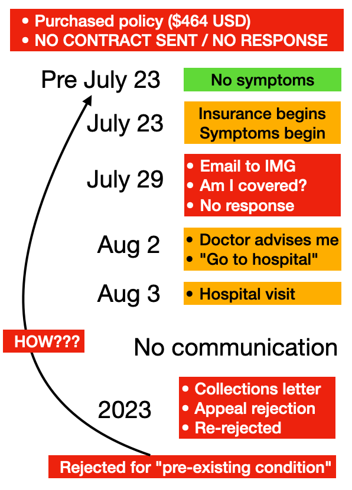
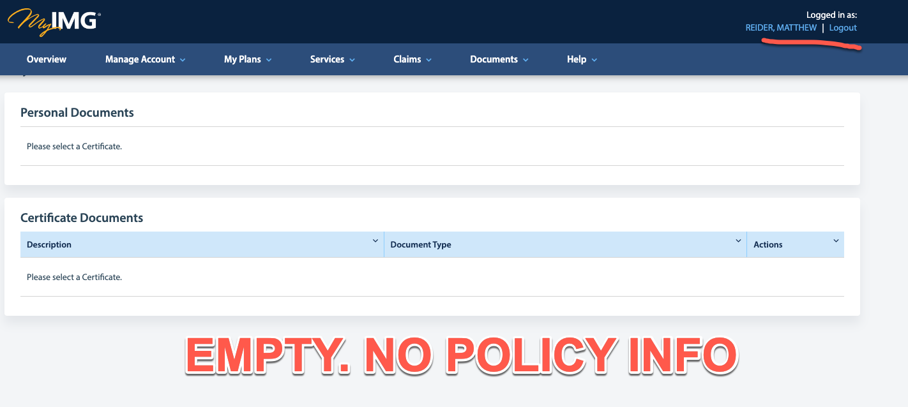

---
---

Here's my experience with IMG Global Insurance.

## Timeline

1. I paid for the Patriot Plan (June 2021) and never recieved the policy paperwork
2. I asked for the paperwork and only got an ID card. No contract sent
3. The contract is still a mystery - it's not attached to the plan in my online account
4. I sent an email asking if an EKG was covered. They never responded.
5. They rejected the claim and never informed me it was rejected
6. I found out via a debt collector almost two years later
7. The claim was rejected for pre-existing conditions - but the medical record showed this was false
8. They rejected my dispute, again, for the same reasons
9. The letter of rejection just states over, and over, that it's a pre-existing condition
10. The medical records shows it is NOT a pre-existing condition

Despite my paying almost $500 for a month's worth of insurance, my legitimate healthcare needs were not covered because of so-called pre-existing conditions. Yet the dates do not line up. All of the paperwork shows this very clearly. The symptoms began as the policy began. Not earlier.

Criminal. 
Opportunistic. 
Disgusting. 

Steer clear of IMG Insurance.

## Details

## Buying the plan

## I asked about coverage (no response)

## The bill

## Collection notice

## Medical record stating NOT a pre-existing condition

## Independent review from International Medical Group / Bessie Banks

## Rejection (again)

If you have any questions I can be reached at mreider at gmail.com

