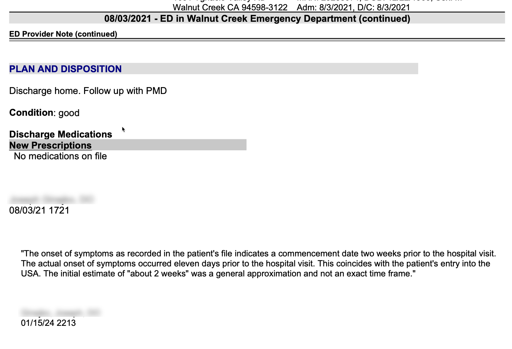

---
---

**Background**

In 2021 I bought IMG Global travel insurance for a trip to California. During my trip I felt chest pain and went to the ER.

The hospital submitted the claim. Two years later I learned that IMG Global denied the claim (over $7,000) and never informed me. The hospital sold the debt to a Swiss collection agency who informed me of the situation.

When I spoke with IMG they told me the hospital report showed that my symptoms began two weeks prior to the visit. Since my policy began 11 days prior - they denied the claim as a pre-existing condition. But this was impossible to me. My chest pain began when I arrived in the USA. If they had started earlier, I would have visited the hospital in Vienna, where I live, and where healthcare is free.

It was obvious that the doctor's notes were an estimate. Perhaps I said "about two weeks ago," or maybe he rounded up.

**Update: Nov 4, 2023**

After sending emails and letters to the physician who treated me, I received a statement from him that "two weeks" was likely an estimate. After sending this to IMG Global, they responded that the statement cannot be included in my file if it is not definitiive. They also asked that it be put in the official report.

**Update: Jan 25th 2024**

After months of back-and-forth with the hospital the doctor finally added the following statement to the official report.

Now the official report reflects reality. It was not a pre-existing condition.

If IMG Global pays the claim, I'll delete this website, thank them, and move on. 

Otherwise, I'll broadcast my story all over the Internet.

- Matt Reider

