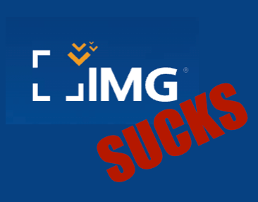
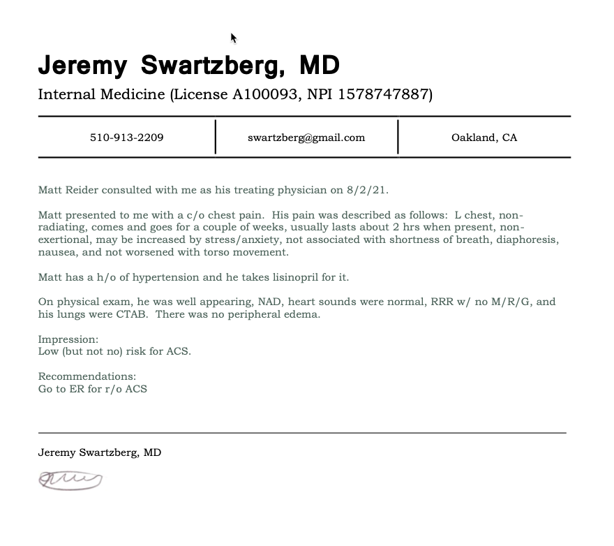
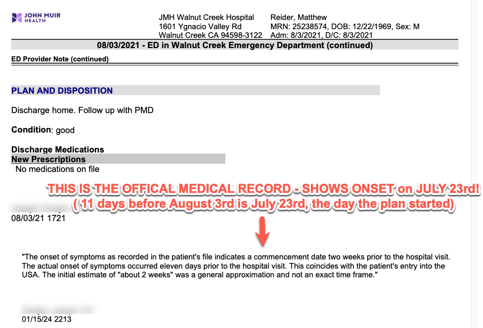

---
---

Here's my experience with IMG Global Insurance.

## Timeline

1. My family and I planned a trip from Austria, where we live, to the USA, where we're from.
2. I paid for IMG Medical's Patriot Plan (June 2021) to cover medical emergencies.
3. I never received the policy paperwork, though I asked multiple times.
4. I visited the USA and felt chest pain.
5. I sent an email asking if an EKG was covered. They never responded.
6. I visited John Muir Hospital upon a doctor's recommendation.
7. I found out via a debt collector, almost two years later, they rejected the claim.
8. The claim was rejected for pre-existing conditions - but the medical record says this is false.
9. They rejected my dispute, again, for the same reasons.
10. The letter of rejection just states over, and over, that it's a pre-existing condition.
11. The medical records show it is NOT a pre-existing condition.
12. Last week I visited my doctor who signed an official letter stating as much.
13. Now I would like to find a local lawyer, in Indianapolis, where IMG is based, to fight this.

## Details

Despite my paying almost $500 for a month's worth of insurance, my legitimate healthcare needs were not covered because of so-called pre-existing conditions. Yet the dates do not line up. All of the paperwork shows this very clearly. The symptoms began as the policy began. Not earlier.

## Buying the plan

<iframe width="560" height="315" src="https://www.youtube.com/embed/NO3xGh4eIIY?si=H_XIXnc5NPkXf6Xe" title="YouTube video player" frameborder="0" allow="accelerometer; autoplay; clipboard-write; encrypted-media; gyroscope; picture-in-picture; web-share" allowfullscreen></iframe>

## I asked about coverage (no response) when I was in the USA.

## Doctor recommended I go to the hospital

## The bill

## Collection notice

## Medical record stating NOT a pre-existing condition

## Independent review from International Medical Group / Bessie Banks

## Rejection (again)

## Statement from my physician

If you have any questions I can be reached at mreider at gmail.com

