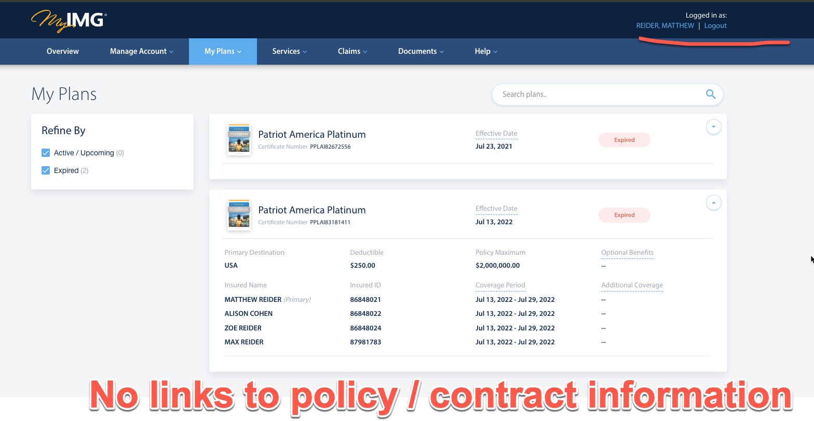
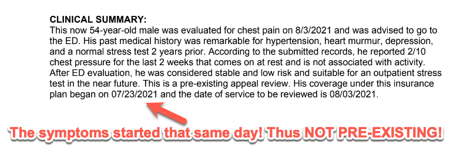

---
---

Buying travel insurance can be a difficult task. My experience with IMG Global has been one of frustration and disappointment. This website is dedicated to sharing that experience, highlighting the issues encountered.

If you have questions I am reachable via mreider at gmail dot com.

## Timeline

1. I paid for the Patriot Plan (June 2021) and never recieved the policy paperwork
2. I asked for the paperwork and only got an ID card. No contract sent
3. The contract is still a mystery - it's not attached to the plan in my online account
4. I sent an email asking if an EKG was covered. They never responded.
5. They rejected the claim and never informed me it was rejected
6. I found out via a debt collector almost two years later
7. The claim was rejected for pre-existing conditions - but the medical record showed this was false
8. They rejected my dispute, again, for the same reasons
9. The letter of rejection just states over, and over, that it's a pre-existing condition
10. The medical record shows it is not

Despite clear evidence contradicting their claims, my legitimate healthcare needs were dismissed under the guise of pre-existing conditions. This experience serves as a warning for anyone considering IMG Global's services. Their lack of response, absence of paperwork, and predatory claim rejections paint a clear picture: steer clear of IMG Global to avoid a similar predicament.

## Details

### Buying the plan

### I asked about coverage (no response)

### The bill

### Collection notice

### Medical record stating NOT a pre-existing condition

### Independent review from International Medical Group / Bessie Banks

### Rejection (again)

